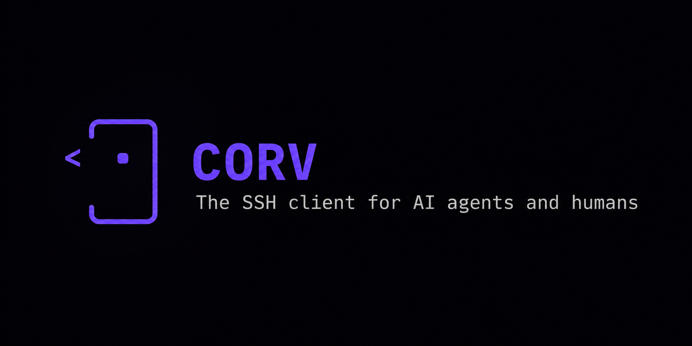
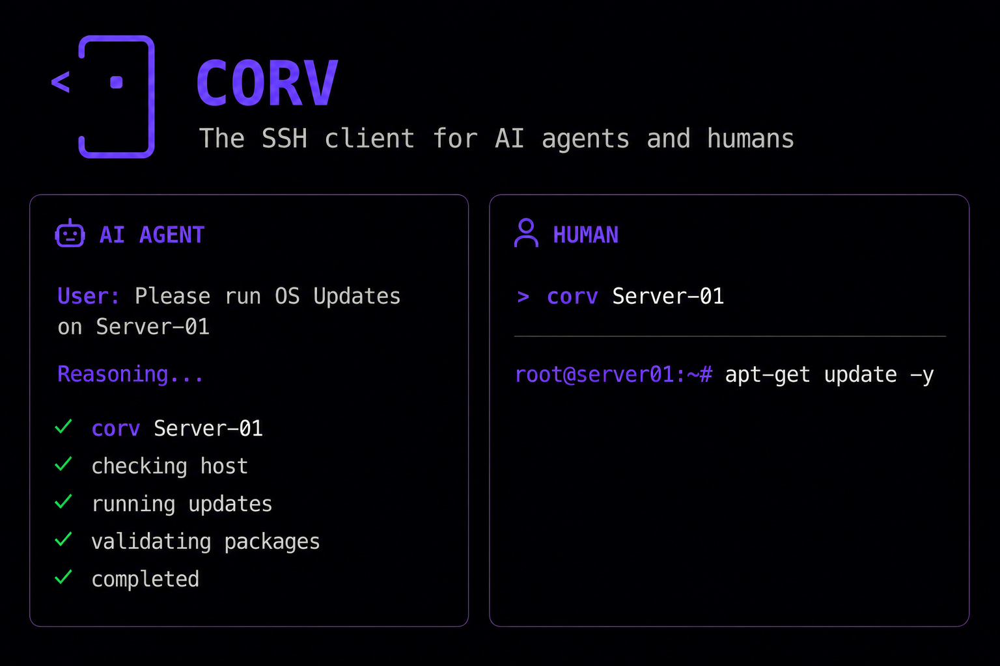

# Corv Client

<p align="center">
  
</p>

**The SSH client for AI agents and humans.** Connect by name. Reuse authenticated SSH connections. Keep secrets local.

AI agents don't use SSH the way humans do. Plain SSH exposes credentials to the caller, returns terminal text that agents
must parse, re-authenticates every command, and relies on tmux, nohup, or custom
scripts for long-running tasks.

Corv is built for agent-driven infrastructure. It lets agents connect by name,
execute commands without exposing passwords or private keys, receive structured
JSON output, reuse a warm authenticated connection, and detach and resume
long-running jobs. Humans use the exact same connections through an interactive
terminal UI.

## Install

**Linux / macOS**

```sh
curl -fsSL https://raw.githubusercontent.com/khalid-src/corv-client/main/install.sh | sh
```

**Windows** (PowerShell)

```powershell
irm https://raw.githubusercontent.com/khalid-src/corv-client/main/install.ps1 | iex
```

**With Go**

```sh
go install github.com/khalid-src/corv-client/cmd/corv@latest
```

**Update or remove**

```sh
corv update      # download and install the latest release (checksum-verified)
corv uninstall   # remove corv; add --purge to also delete saved connections
```

`corv update` only runs when you run it - Corv never updates itself in the
background.

## Usage

<p align="center">
  
</p>

Manage connections interactively:

```bash
corv
```

The terminal interface supports keyboard and mouse navigation to add, edit,
import from `~/.ssh/config`, and connect. Connections can also be managed from
the command line:

```bash
corv add srv-01 ubuntu@10.0.0.4                      # prompts for a password if needed
corv add srv-01 ubuntu@10.0.0.4 --key ~/.ssh/id_ed25519
corv add db-01 ubuntu@10.0.0.9 --jump ubuntu@bastion # reach through a bastion
corv import                                          # import hosts from ~/.ssh/config
corv list
corv rm srv-01
```

Hosts behind one or more bastions are reached with `--jump` (OpenSSH `-J`
syntax: `user@host1,user@host2`). Jump hosts authenticate with `ssh-agent`
or your keys; the target uses the connection's own credentials.

`corv add` reads any password without echo and stores it in the local
encrypted vault; it is never passed as an argument.

Connect interactively:

```bash
corv srv-01
```

Run a command non-interactively (the agent path):

```bash
corv srv-01 -- systemctl restart api
corv srv-01 --json -- df -h              # structured output for tools
corv srv-01 -- ./deploy.sh
echo 'cd /app && run "$X" | grep foo' | corv srv-01 --json --stdin
corv srv-01 --json --stdin < script.sh
```

A typical agent instruction such as "restart the API service on srv-01"
requires only `corv srv-01 -- systemctl restart api`.

Command handling after `--` is designed to do what you mean:

- a **single** argument is treated as a remote shell command line and run
  as-is, like `ssh host "cmd"` - e.g. `corv srv -- "cd /app && make"`;
- **multiple** arguments are passed as a preserved argument vector, each
  shell-quoted so the remote cannot re-split them - e.g.
  `corv srv -- sh -lc "cd /app && make"`.

This avoids the raw-`ssh` pitfall where quoted arguments lose their
boundaries, which matters for agents that build argument vectors.

For complex shell text, nested quotes, or multi-line scripts, use an stdin
mode. `--stdin-base64` is the cross-shell-safe option because only ASCII
base64 passes through the local pipe.

### Windows / PowerShell

PowerShell can mangle quoting and pipe encoding, so encode a non-trivial remote
command as UTF-8 base64 and send it with `--stdin-base64`:

```powershell
$b64=[Convert]::ToBase64String([Text.Encoding]::UTF8.GetBytes(@'
set -eu
cd /srv/app && ./deploy.sh
'@)); $b64 | corv srv-01 --json --stdin-base64
```

Only ASCII base64 crosses the pipe, so the command arrives unchanged - quoting
and any non-ASCII text survive intact. A simple exact argument vector can still
use `-- <command>`.

Long commands are detached on the server automatically. If a command is still
running after the broker's wait window, Corv returns the new bounded output,
the run id, and exit code `75`. Re-run the exact same command to watch the next
delta; it attaches to the existing remote job and does not start a second copy.
When the job finishes, Corv saves the log locally (up to 20 MiB; a larger log is
truncated, with a marker and a `truncated` flag in `corv output --json`) and
removes the remote temporary files:

```bash
corv srv-01 -- ./long-install.sh
corv srv-01 -- ./long-install.sh       # same command: continue watching
corv output <run-id>                   # finalize if done, then show the saved log
```

`CORV_WAIT` controls how long the broker waits before returning a `running`
response. It accepts bare seconds (`CORV_WAIT=30`) or a Go duration
(`CORV_WAIT=500ms`, `CORV_WAIT=2m`) and is read from the environment of each
`corv` invocation, so it takes effect immediately without restarting the broker.
`corv output <run-id>` checks an unfinished detached run and finalizes it
automatically once the remote exit status exists. Remote temp files are cleaned
on finalization; abandoned jobs are cleaned by the broker's startup sweep after
24 hours.

Remote command execution requires a POSIX shell and standard Unix command-line
tools. Windows OpenSSH servers are not supported as remote execution targets.

## Use with AI agents

Corv is built for AI coding agents (Claude, Codex, and others). Ready-to-use
agent instructions live in [`integrations/`](integrations/):

- **Claude / Claude Code** - copy `integrations/claude/corv-ssh` into
  `~/.claude/skills/` (or a project's `.claude/skills/`).
- **Codex** - copy `integrations/codex/AGENTS.md` into your project.

The agent then runs commands by name and reads structured output:

```bash
corv <name> --json -- <command>
```

For non-trivial scripts or heavily quoted commands, agents should send the
remote command as UTF-8 base64:

```powershell
$b64=[Convert]::ToBase64String([Text.Encoding]::UTF8.GetBytes(@'
set -eu
cd /srv/app && ./deploy.sh
'@)); $b64 | corv <name> --json --stdin-base64
```

Agents should not run `corv list --full` or `corv doctor --full` unless the
user explicitly asks; those modes show local connection details. Never put
passwords, private keys, API tokens, kubeadm tokens, bearer tokens, or other
secrets on the command line. Corv command history records command lines.

See [`integrations/README.md`](integrations/README.md) for details.

## Connection reuse

A local broker process holds one authenticated SSH connection per machine.
Each `corv <name> -- <cmd>` runs as a new channel over the held connection, so
the connection and authentication cost is paid once rather than on every
command. This behaviour is identical on Linux, macOS, and Windows.

The broker starts automatically on first use, exits after 15 minutes idle, and
installs nothing on the server. It manages SSH connections only; it does not
allocate a local pseudo-terminal, parse shell output, or maintain remote shell
state. A held connection can be dropped explicitly:

```bash
corv disconnect srv-01
```

Scope and limitations:

- This is connection reuse, not remote session persistence. Each command runs
  in its own shell with its own exit code; shell state such as the working
  directory does not carry between commands (combine them in a single command
  when required, e.g. `cd /app && make`).
- Because the broker is local, a held connection does not survive the local
  machine sleeping or a network interruption. Persistence across those events
  requires remote support, which Corv does not depend on by design.

Interactive sessions open a dedicated connection and proxy the remote
pseudo-terminal to the local terminal, so no local pseudo-terminal is required
on any platform.

## Output processing

Corv normalises command output for programmatic consumers:

- progress bars and other carriage-return redraws are collapsed to their final
  state rather than reproduced as thousands of lines;
- ANSI control sequences, including colour, are removed;
- a command's stdout and stderr are captured together, interleaved in the order
  they were written, and returned in `stdout`; with `--json`, the `stderr` field
  carries Corv-level errors (e.g. transport failures), not the remote command's
  own stderr;
- a finished command returns its output in full up to a generous byte budget;
  only genuinely large output is trimmed to a leading and trailing section with
  a `... N line(s) hidden ...` marker (the saved log, up to 20 MiB, stays
  available via `corv output <run-id>`), and a still-running command returns a
  short peek;
- transport failures are classified (`auth_failed`, `unknown_host`,
  `unreachable`, `host_key`, `timeout`, `disconnected`), and the remote exit
  code is propagated as the process exit code.

## Security model

Corv runs entirely on the client and implements SSH through the maintained Go
SSH library (`golang.org/x/crypto/ssh`).

- Nothing is installed on the destination server.
- Connection profiles are encrypted at rest with the OS-protected vault key,
  so the connection file does not expose hosts, users, or paths in plaintext
  (`corv list` is the way to view them).
- Passwords and key passphrases are stored in a local encrypted vault. The
  vault key is protected by DPAPI on Windows; on macOS and Linux Corv reads a
  provisioned Keychain / Secret Service key when present (it never auto-creates
  one) and otherwise uses a `0600` key file, the default. Stored secrets are
  read only by the local broker and sent over the
  authenticated SSH connection; they do not appear on a command line, in logs,
  or in command output. Key-based authentication or `ssh-agent` is recommended.
- Audit logs and saved run logs are local and can contain the command text or
  remote output an operator asked Corv to run. Never put passwords, private
  keys, API tokens, kubeadm tokens, bearer tokens, or other secrets on the
  command line; command history records command lines.
- Authentication is attempted in order: configured identity file, `ssh-agent`
  (via `SSH_AUTH_SOCK` on Unix, the `openssh-ssh-agent` named pipe on
  Windows), default `~/.ssh` keys, then password.
- Bastion (`ProxyJump`) hops are host-key verified individually and can
  authenticate with `ssh-agent`, default keys, a per-hop identity file, or a
  password/passphrase sourced from a saved profile.
- Host keys are verified against `~/.ssh/known_hosts`. An unknown host is
  rejected unless approved interactively; the broker never accepts unknown
  hosts automatically. A changed host key is always rejected.
- The broker uses OS-permissioned local IPC (Unix socket or Windows named
  pipe) plus an endpoint token for defense in depth.

## Architecture

Corv is composed of small, independent modules so that the SSH backend or the
output processor can be replaced without affecting the rest:

| Package            | Responsibility                                          |
| ------------------ | ------------------------------------------------------- |
| `internal/profile` | connection definitions, storage, `~/.ssh/config` import |
| `internal/vault`   | local encrypted secret store (DPAPI / key file)         |
| `internal/sshconn` | SSH transport (x/crypto/ssh): dial, auth, exec, shell   |
| `internal/broker`  | resident process holding one connection per host        |
| `internal/output`  | output processor (collapse, strip, bound)               |
| `internal/audit`   | local command history                                   |
| `internal/tui`     | interactive terminal UI (Bubble Tea)                    |
| `internal/cli`     | command-line routing                                    |
| `internal/paths`   | on-disk file locations                                  |

## Development

```bash
make vet         # go vet ./...
make build       # build ./bin/corv
make build-all   # cross-compile linux/macOS/windows
```

Corv targets Go 1.25+ on Linux, macOS, and Windows.

## License

See [LICENSE](LICENSE).

## Acknowledgments

Built with the assistance of AI coding tools: Claude Opus 4.8 and GPT-5.5.
