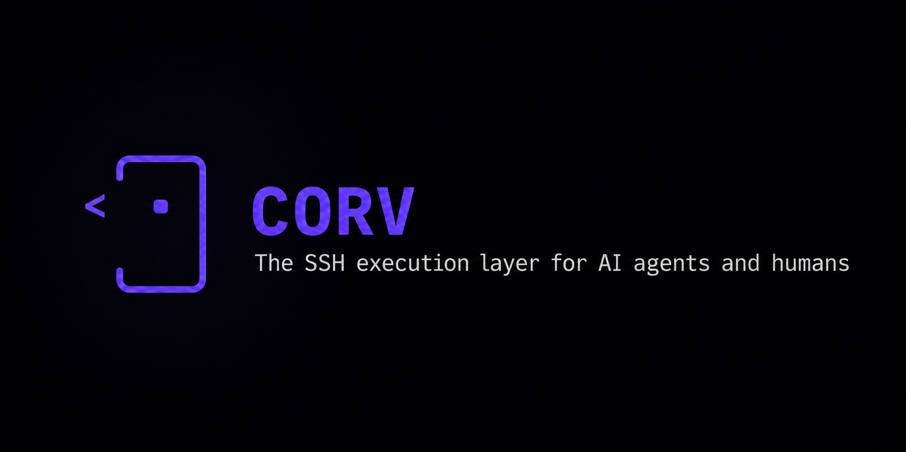

# Corv

<p align="center">
  
</p>

**The SSH execution layer for AI agents and humans.** Connect by name, run commands over warm authenticated connections, and get structured, bounded output with at-most-once safety for retried operations.

[](https://github.com/khalid-src/corv-client/actions/workflows/ci.yml)
[](https://github.com/khalid-src/corv-client/releases)
[](LICENSE)
[](go.mod)

[Latest release: Corv v1.1.1](docs/releases/v1.1.1.md) |
[Complete changelog](CHANGELOG.md)

AI agents don't use SSH the way humans do. Raw SSH requires the calling workflow
to manage connection details, authentication configuration, prompts, and
terminal output. Independent invocations also repeat connection setup unless
OpenSSH multiplexing is configured, while long-running work commonly needs
tmux, nohup, or custom scripts.

Corv is built for agent-driven infrastructure. It lets agents connect by name,
execute commands without exposing passwords or private keys, receive structured
JSON output, reuse a warm authenticated connection, and detach and resume
long-running jobs. Humans use the same saved connection profiles through an
interactive terminal UI.

## Built for production

Corv is engineered for unattended, agent-driven work against real infrastructure:

- **At-most-once execution.** A caller-supplied idempotency key makes a mutating
  command safe to retry. A lost response, a broker restart, or a full host reboot
  does not run it twice (verified against live hosts).
- **Crash-safe local state.** Connection, vault, and job state are written
  atomically, so a crash or power loss cannot corrupt or lose them.
- **Token-lean structured output.** Combined stdout and stderr are de-noised
  (ANSI and progress-bar collapse) and bounded to a head and tail, so a
  multi-megabyte log never exhausts an agent's context; the full log stays
  retrievable by run ID.
- **Secrets never leak.** Credentials are encrypted at rest (DPAPI, Keychain, or a
  `0600` key file) and never appear on a command line, in logs, or in agent
  output. Run identity is a vault-keyed HMAC, so `jobs.json` carries no offline
  password verifier.
- **Real, verified SSH.** Host keys are checked against `known_hosts`, ProxyJump
  bastions and `ssh-agent` are supported, and nothing is installed on the server.
- **Detached, recoverable jobs.** Long-running commands survive client and network
  interruption and are recoverable by run ID.
- **Identical on Linux, macOS, and Windows.** A single dependency-free binary with
  no daemon to manage.

Structured JSON for agents, an interactive terminal UI for humans, both driving the
same saved connections.

## Install

**Linux / macOS**

```sh
curl -fsSL https://raw.githubusercontent.com/khalid-src/corv-client/main/install.sh | sh
```

**Windows** (PowerShell)

```powershell
irm https://raw.githubusercontent.com/khalid-src/corv-client/main/install.ps1 | iex
```

**With Go**

```sh
go install github.com/khalid-src/corv-client/cmd/corv@latest
```

**Update or remove**

```sh
corv update      # download and install the latest release (checksum-verified)
corv uninstall   # remove corv; add --purge to also delete saved connections
```

`corv update` only runs when you run it - Corv never updates itself in the
background.

Manage connections interactively:

```bash
corv
```

The terminal interface supports keyboard and mouse navigation to add, edit,
import from `~/.ssh/config`, and connect. Connections can also be managed from
the command line:

```bash
corv add prod-api deploy@api.example.com                    # prompts for a password if needed
corv add prod-api deploy@api.example.com --key ~/.ssh/id_ed25519
corv add prod-db dbadmin@db.example.com --jump ops@bastion.example.com
corv import                                          # import hosts from ~/.ssh/config
corv list
corv test prod-api                                   # diagnose connection stages
corv status                                          # show warm connections and active runs
corv jobs                                            # list active and retained run IDs
corv rm prod-api
```

`corv test <name>` opens and immediately closes a one-off SSH connection. It
checks resolution, TCP reachability, bastion routing, the SSH handshake,
host-key trust, and authentication without running a remote command. Add
`--json` for structured diagnostics. Raw targets and addresses require
`--full`. `corv status` reports the connections the local broker currently
holds, hides targets unless `--full` is specified, and does not start a stopped
broker.

`corv doctor` also checks whether encrypted local state and every referenced
stored credential are readable. Its default output identifies the failure
category without exposing paths or connection details; use `--full` only when
detailed local diagnostics are appropriate.

The encrypted store is bound to the OS user profile that created it. Run Corv
and any agent or service that invokes it as that same OS user, with the user's
profile and keychain context loaded. A sandbox, elevated account, service
account, or different login may be unable to decrypt otherwise valid state;
`corv doctor` reports this separately from SSH authentication failures.

Hosts behind one or more bastions are reached with `--jump` (OpenSSH `-J`
syntax: `user@host1,user@host2`). Jump hosts authenticate with `ssh-agent`
or your keys; the target uses the connection's own credentials.

`corv add` reads any password without echo and stores it in the local
encrypted vault; it is never passed as an argument.

`corv vault reset` clears stored SSH passwords and private-key passphrases while
keeping saved connections. It asks for confirmation and stops the local broker
before changing state. If the encrypted connection store cannot be opened,
Corv cannot determine whether its key is unavailable or the config file is
damaged; it refuses a normal reset. `corv vault reset --all` explicitly removes
the local connection store, vault data, backend marker, and Corv-managed local
key file. Externally provisioned OS keychain entries are not removed.

Connect interactively:

```bash
corv prod-api
```

Run a command non-interactively (the agent path):

```bash
corv prod-api -- uname -a
corv prod-api --json -- df -h             # structured output for tools
corv prod-api -- ./deploy.sh
corv prod-api --run-key change-42 -- ./deploy.sh
echo 'cd /app && run "$X" | grep foo' | corv prod-api --json --stdin
corv prod-api --json --stdin < script.sh
```

A typical agent instruction such as "check disk usage on prod-api" requires
only `corv prod-api -- df -h`.

Command handling after `--` is designed to do what you mean:

- a **single** argument is treated as a remote shell command line and run
  as-is, like `ssh host "cmd"` - e.g. `corv srv -- "cd /app && make"`;
- **multiple** arguments are passed as a preserved argument vector, each
  shell-quoted so the remote cannot re-split them - e.g.
  `corv srv -- sh -lc "cd /app && make"`.

This preserves argument boundaries for callers that construct command vectors.
Detached scripts run under POSIX `sh`. Use only POSIX shell syntax, or invoke an
available alternate shell explicitly, for example `bash -lc '...'`.

For complex shell text, nested quotes, or multi-line scripts, use an stdin
mode. `--stdin-base64` is the cross-shell-safe option because only ASCII
base64 passes through the local pipe.

### Windows / PowerShell

PowerShell can mangle quoting and pipe encoding, so encode a non-trivial remote
command as UTF-8 base64 and send it with `--stdin-base64`:

```powershell
$b64=[Convert]::ToBase64String([Text.Encoding]::UTF8.GetBytes(@'
set -eu
cd /srv/app && ./deploy.sh
'@)); $b64 | corv prod-api --json --stdin-base64
```

Only ASCII base64 crosses the pipe, so the command arrives unchanged - quoting
and any non-ASCII text survive intact. A simple exact argument vector can still
use `-- <command>`.

Long commands are detached on the server automatically. If a command is still
running after the broker's wait window, Corv returns bounded progress output,
the run id, and exit code `75`. Use `corv output <run-id>` to check it without
restarting the command. Re-running the byte-identical original command also
reattaches while it remains active, but run IDs are the clearer recovery path.
When the job finishes, Corv retains up to 20 MiB locally and removes the remote
temporary files. If a log is larger, Corv keeps its first 4 MiB and its final
section with an omission marker between them, so late failures are not lost.
`truncated: true` in `corv output --json` reports this case:

```bash
corv prod-api -- ./long-install.sh
corv output <run-id> [pattern]         # bounded status/output view
corv jobs                              # recover active/recent run IDs
```

For a mutating command that may be retried after a lost response, supply a
stable run key:

```bash
corv prod-api --run-key change-42 -- ./deploy.sh
```

The key is scoped to the saved connection within one local Corv state directory.
Two machines, or two separate state directories, do not share replay records:
the same key can execute once in each. Keep the same client state when retrying;
Corv does not provide fleet-wide deduplication.

The same key and command reattach to
the active run or return its retained result; using the key with a different
command or changed connection state fails with `error_kind: run_key_conflict`.
Completed replay records are retained for 24 hours, after which the key can be
used again. A run without a known outcome keeps its key so Corv does not trade
uncertain recovery for a possible duplicate execution. If Corv reports
`run_expired`, verify the remote effect before choosing a new run key; retrying
the expired key will not execute the command again. This is replay suppression,
not a permanent distributed transaction. Never place credentials or other
secrets in a run key.

Command history has no automatic rotation or retention limit. `corv log --clear`
erases the entire local audit log, including older entries. Save any history you
need before clearing it; the 24-hour run-log retention does not apply to audit
history.

`CORV_WAIT` controls how long the broker waits before returning a `running`
response. It accepts bare seconds (`CORV_WAIT=30`) or a Go duration
(`CORV_WAIT=500ms`, `CORV_WAIT=2m`) and is read from the environment of each
`corv` invocation, so it takes effect immediately without restarting the broker.
`corv output <run-id>` returns a bounded recent-output snapshot while a run is
active, then finalizes it automatically once the remote exit status exists.
Snapshots do not consume or alter the command's saved output offset. Remote
temp files are cleaned
on finalization. The startup sweep removes completed remote remnants older than
24 hours; it never deletes a run without an exit status because age alone cannot
distinguish an abandoned run from a silent live process. Saved local run logs
and their metadata are retained for 24 hours and removed on broker startup.

`corv output` exits `75` while a run is active, with the remote exit code when
it completes, and `1` for a Corv retrieval error. The process exit code and JSON
`exit_code` field use the same value.

All agent-facing output is bounded. Completed responses and `corv output`
return a middle-out view of roughly 32 KiB; running responses use a smaller
budget. Pass a pattern to `corv output` to select relevant lines before that
budget is applied. JSON responses report `original_bytes`, `saved_bytes`,
`returned_bytes`, `truncated` (the retained log omitted bytes), and
`output_truncated` (the returned view was bounded) when applicable. A JSON
`lossy: true` field means invalid UTF-8 bytes were replaced for text-safe output;
inspect the producing command or use a text-safe encoding when byte fidelity
matters.

Remote command execution requires a POSIX shell and standard Unix command-line
tools. Scripts execute with `sh`; bash-specific syntax requires an explicit
`bash -lc` on a host where Bash is installed. Windows OpenSSH servers are not
supported as remote execution targets.

## Use with AI agents

Corv is built for AI coding agents (Claude, Codex, and others). Ready-to-use
agent instructions live in [`integrations/`](integrations/):

- **Claude / Claude Code** - copy `integrations/claude/corv-ssh` into
  `~/.claude/skills/` (or a project's `.claude/skills/`).
- **Codex** - copy `integrations/codex/AGENTS.md` into your project.

The agent then runs commands by name and reads structured output:

```bash
corv <name> --json -- <command>
```

For non-trivial scripts or heavily quoted commands, agents should send the
remote command as UTF-8 base64:

```powershell
$b64=[Convert]::ToBase64String([Text.Encoding]::UTF8.GetBytes(@'
set -eu
cd /srv/app && ./deploy.sh
'@)); $b64 | corv <name> --json --stdin-base64
```

Agents should not run `corv list --full`, `corv doctor --full`, `corv test
<name> --full`, or `corv status --full` unless the user explicitly asks; those
modes show local connection details. Never put
passwords, private keys, API tokens, bootstrap tokens, bearer tokens, or other
secrets on the command line. Corv command history records command lines.
Use `corv jobs --json` to recover active or recently retained run IDs. Its
status is the last locally recorded state. An old run with no recent remote
observation is shown as `unknown`, without an exit code. Use `corv output
<run-id>` to probe it: a live run returns current progress, while missing remote
state becomes `expired`, still without an invented exit code. Use `corv log
--json` when structured local command history is needed.

See [`integrations/README.md`](integrations/README.md) for details.

## Connection reuse

A local broker process holds one authenticated SSH connection per saved profile.
Each `corv <name> -- <cmd>` runs as a new channel over the held connection, so
the connection and authentication cost is paid once rather than on every
command. This behaviour is identical on Linux, macOS, and Windows.

OpenSSH can also reuse connections on Unix through `ControlMaster` and a control
socket. Corv provides the same warm-connection model through its local broker so
agent workflows behave consistently on Windows, macOS, and Linux.

The broker starts automatically on first use, exits after 15 minutes idle, and
installs nothing on the server. It manages SSH connections only; it does not
allocate a local pseudo-terminal, parse shell output, or maintain remote shell
state. A held connection can be dropped explicitly:

```bash
corv disconnect prod-api
```

Scope and limitations:

- This is connection reuse, not remote session persistence. Each command runs
  in its own shell with its own exit code; shell state such as the working
  directory does not carry between commands (combine them in a single command
  when required, e.g. `cd /app && make`).
- Because the broker is local, a held connection does not survive the local
  machine sleeping or a network interruption. Persistence across those events
  requires remote support, which Corv does not depend on by design.

Interactive sessions open a dedicated connection and proxy the remote
pseudo-terminal to the local terminal, so no local pseudo-terminal is required
on any platform.

## Output processing

Corv normalises command output for programmatic consumers:

- progress bars and other carriage-return redraws are collapsed to their final
  state rather than reproduced as thousands of lines;
- ANSI control sequences, including colour, are removed;
- a command's stdout and stderr are captured together, interleaved in the order
  they were written, and returned in `stdout`; with `--json`, the `stderr` field
  carries Corv-level errors (e.g. transport failures), not the remote command's
  own stderr;
- completed and running responses use fixed byte budgets and preserve the
  beginning and end with a `... N line(s) hidden ...` marker; `corv output
  <run-id> [pattern]` queries the retained log through the same bounded
  presentation contract;
- failures are classified (`auth_failed`, `unknown_host`,
  `unknown_connection`, `bad_request`, `local_error`, `unreachable`,
  `host_key`, `timeout`, `disconnected`, `resource_exhausted`,
  `run_key_conflict`, `run_expired`, `output_unavailable`, `ssh_error`),
  and the remote exit code is propagated as the process exit code.

## Security model

Corv runs entirely on the client and implements SSH through the maintained Go
SSH library (`golang.org/x/crypto/ssh`).

- Nothing is installed on the destination server.
- Connection profiles are encrypted at rest with the same local vault key used
  for stored credentials,
  so the connection file does not expose hosts, users, or paths in plaintext
  (`corv list` is the way to view them).
- Passwords and key passphrases are stored in a local encrypted vault. The
  vault key is protected by DPAPI on Windows; on macOS and Linux Corv reads a
  provisioned Keychain / Secret Service key when present (it never auto-creates
  one) and otherwise uses a `0600` key file, the default. Stored secrets are
  read only by the local broker and sent over the
  authenticated SSH connection; they do not appear on a command line, in logs,
  or in command output. Key-based authentication or `ssh-agent` is recommended.
- Audit logs and saved run logs are local and can contain the command text or
  remote output an operator asked Corv to run. Never put passwords, private
  keys, API tokens, bootstrap tokens, bearer tokens, or other secrets on the
  command line; command history records command lines.
- Authentication is attempted in order: configured identity file, `ssh-agent`
  (via `SSH_AUTH_SOCK` on Unix, the `openssh-ssh-agent` named pipe on
  Windows), default `~/.ssh` keys, then password.
- Bastion (`ProxyJump`) hops are host-key verified individually and can
  authenticate with `ssh-agent`, default keys, a per-hop identity file, or a
  password/passphrase sourced from a saved profile.
- Host keys are verified against `~/.ssh/known_hosts`. An unknown host is
  rejected unless approved interactively; the broker never accepts unknown
  hosts automatically. A changed host key is always rejected.
- The broker uses OS-permissioned local IPC (Unix socket or Windows named
  pipe) plus an endpoint token for defense in depth.

### Threat model

Corv trusts the local user account and the machine it runs on. Within that
boundary it protects credentials: they are encrypted at rest, sent only over the
authenticated SSH connection, and never written to a command line, prompt, log,
or agent-visible output, so an agent can use a connection without the secret
entering its context.

Corv does not sandbox local execution. Anyone, or anything, able to run `corv`
as your user can use your saved connections, exactly as they could with `ssh`,
`ssh-agent`, or your `~/.ssh` keys and cloud credentials. Corv is a client
acting with your authority, not a security boundary against a compromised local
environment; a changed host key is refused, but an authorized local caller is
trusted.

Defending against untrusted local execution is therefore out of scope for the
client and belongs to the environment: do not give untrusted or experimental
agents shell access to a machine that holds real credentials, and enforce least
privilege on the server (restricted users, limited `sudo`, short-lived SSH
certificates or STS tokens, tight network rules).

## Architecture

Corv is composed of small, independent modules so that the SSH backend or the
output processor can be replaced without affecting the rest:

| Package            | Responsibility                                          |
| ------------------ | ------------------------------------------------------- |
| `internal/profile` | connection definitions, storage, `~/.ssh/config` import |
| `internal/vault`   | local encrypted secret store and key backends           |
| `internal/sshconn` | SSH transport (x/crypto/ssh): dial, auth, exec, shell   |
| `internal/broker`  | resident process holding one connection per profile     |
| `internal/output`  | output processor (collapse, strip, bound)               |
| `internal/audit`   | local command history                                   |
| `internal/tui`     | interactive terminal UI (Bubble Tea)                    |
| `internal/cli`     | command-line routing                                    |
| `internal/statelock` | cross-process lock serialising local state writes     |
| `internal/atomicfile` | crash-safe atomic file writes                        |
| `internal/paths`   | on-disk file locations                                  |

See [docs/architecture.md](docs/architecture.md) for the detached-run state
machine, broker lock ownership, and persistence invariants.

## Development

```bash
go build ./...
go vet ./...
go test ./...
```

The Makefile also provides `make build` and `make build-all` on systems with
`make`. Corv targets Go 1.26.8; CI and
release builds use the version pinned in `go.mod` on Linux, macOS, and Windows.

## License

See [LICENSE](LICENSE).
